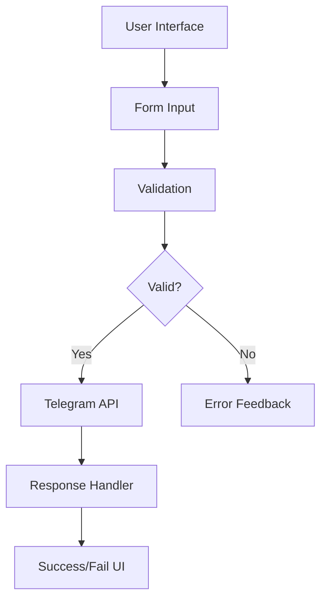

Telegram Web Messenger

Telegram Web Messenger adalah aplikasi web minimalis dan responsif untuk mengirim pesan ke bot Telegram secara langsung melalui browser. Aplikasi ini menyediakan antarmuka yang intuitif dengan fitur real-time status monitoring dan animasi feedback visual.

https://via.placeholder.com/800x400/0088cc/ffffff?text=Telegram+Web+Messenger+Preview

✨ Features

✅ Fitur Utama

· Real-time Bot Status: Monitoring status bot dengan indikator visual
· Responsive Design: Kompatibel dengan semua device (desktop, tablet, mobile)
· Local Storage: Penyimpanan lokal untuk token dan chat ID
· Live Character Counter: Penghitung karakter real-time dengan limit Telegram

🎨 UI/UX Features

· Minimalist Interface: Desain bersih dan fokus pada fungsionalitas
· Visual Feedback:
  · Animasi loading saat pengiriman
  · Notifikasi sukses/gagal dengan animasi
  · Indikator status dengan animasi ripple
· Input Validation: Validasi otomatis untuk semua field

🔧 Technical Features

· Debounced API Calls: Optimasi pengecekan status bot
· Error Handling: Penanganan error yang user-friendly
· Auto-save: Data tersimpan otomatis saat perubahan
· Cross-browser Compatible: Mendukung browser modern

🚀 Quick Start

Prerequisites

· Akun Telegram
· Bot Telegram (dari @BotFather)
· Web browser modern

Setup Instan

1. Clone repository:

```bash
git clone https://github.com/yourusername/telegram-web-messenger.git
```

1. Buka file index.html di browser

Setup dengan Bot Telegram

1. Dapatkan Bot Token:
   · Buka @BotFather di Telegram
   · Buat bot baru dengan /newbot
   · Simpan token yang diberikan
2. Dapatkan Chat ID:
   · Buka @userinfobot
   · Kirim pesan apa saja
   · Catat ID yang diberikan
3. Konfigurasi Web:
   · Buka aplikasi di browser
   · Masukkan token dan chat ID
   · Mulai mengirim pesan!

📁 Project Structure

```
telegram-web-messenger/
├── index.html              # Main application
├── README.md              # Documentation
├── screenshot.png         # App preview
└── assets/               # Optional for future expansion
    ├── css/
    │   └── style.css     # External stylesheet
    ├── js/
    │   └── app.js        # External JavaScript
    └── icons/            # Custom icons
```

🛠 Technical Implementation

Architecture



Technologies Used

· Frontend: HTML5, CSS3, Vanilla JavaScript
· APIs: Telegram Bot API
· Storage: Browser LocalStorage
· Icons: Font Awesome 6
· Fonts: System UI fonts stack

Key Components

1. Status Monitor: Periodic bot health check
2. Message Handler: Send message with error handling
3. UI Controller: Manage animations and feedback
4. Storage Manager: Local data persistence

📖 Usage Guide

Basic Usage

```
1. Enter bot token (from @BotFather)
2. Enter chat ID (from @userinfobot)
3. Type your message
4. Click "Kirim" button
```

Advanced Features

· Auto Status Check: Bot status checked every 30 seconds
· Character Limit: Enforces Telegram's 4000-character limit
· Debounced Input: Delayed API calls to prevent rate limiting
· Error Recovery: Graceful handling of network issues

Local Storage Schema

```json
{
  "telegramBotData": {
    "token": "bot_token_here",
    "chatId": "chat_id_here",
    "message": "last_message_content"
  }
}
```

🔒 Security Considerations

Data Privacy

· No Server Storage: All data stays in your browser
· Local Only: Token dan chat ID tidak dikirim ke server lain
· Client-side Processing: Semua operasi dilakukan di client

Best Practices

1. Token Security: Jangan share token bot dengan orang lain
2. Chat ID Privacy: Chat ID bersifat pribadi
3. Regular Updates: Update token jika diperlukan

🌐 API Reference

Telegram API Endpoints Used

```javascript
// Check bot status
GET https://api.telegram.org/bot{token}/getMe

// Send message
POST https://api.telegram.org/bot{token}/sendMessage
```

Response Handling

```javascript
// Success response
{
  "ok": true,
  "result": {
    "message_id": 123,
    "from": {...},
    "chat": {...}
  }
}

// Error response
{
  "ok": false,
  "description": "Error description"
}
```

📱 Responsive Design

Breakpoints

```css
/* Mobile: < 400px */
/* Tablet: 400px - 600px */
/* Desktop: > 600px */
```

Supported Devices

· ✅ Smartphones (iOS & Android)
· ✅ Tablets (iPad, Android tablets)
· ✅ Desktop (Windows, macOS, Linux)
· ✅ Modern browsers (Chrome, Firefox, Safari, Edge)

🔄 Development

Setup Development

```bash
# Clone repository
git clone https://github.com/yourusername/telegram-web-messenger.git

# Navigate to project
cd telegram-web-messenger

# Open in browser
open index.html
# or
start index.html
```

File Structure Details

· index.html: Main HTML structure
· Inline CSS: All styles in one file
· Inline JS: All logic in one file
· No dependencies required

📈 Future Enhancements

Planned Features

· Multiple chat support
· Message history
· File attachment support
· Scheduled messages
· Theme customization
· Multi-language support

Technical Improvements

· PWA implementation
· Service workers for offline
· Enhanced error logging
· Unit tests
· CI/CD pipeline

🤝 Contributing

Guidelines

1. Fork the repository
2. Create feature branch (git checkout -b feature/AmazingFeature)
3. Commit changes (git commit -m 'Add AmazingFeature')
4. Push to branch (git push origin feature/AmazingFeature)
5. Open Pull Request

Code Style

· Use semantic HTML
· Follow BEM naming for CSS
· Use ES6+ JavaScript features
· Comment complex logic

🐛 Troubleshooting

Common Issues

1. Bot not responding: Check token validity
2. Message not sent: Verify chat ID
3. Status not updating: Check network connection
4. Data not saving: Clear browser cache

Debug Mode

```javascript
// Enable console logging
localStorage.debug = true;
```

📄 License

This project is licensed under the MIT License - see the LICENSE file for details.

🙏 Acknowledgments

· Telegram for their excellent Bot API
· Font Awesome for beautiful icons
· Contributors who help improve this project

📞 Support

For support, email: [your-email@example.com] or open an issue in the GitHub repository.

📊 Project Stats

https://img.shields.io/github/repo-size/yourusername/telegram-web-messenger
https://img.shields.io/github/last-commit/yourusername/telegram-web-messenger
https://img.shields.io/github/issues/yourusername/telegram-web-messenger

---

⭐ Jika project ini membantu Anda, pertimbangkan untuk memberikan star di repository!

Made with ❤️ untuk komunitas Telegram developers
